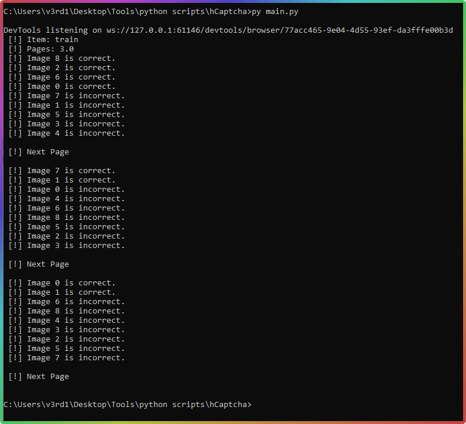

# hCaptcha Solver
DONE - Has successfully solved captcha around 3 times in testing. Working on making it faster so it doesn't expire.

Credit to <a href="https://github.com/FliiGQ">FliiGQ</a> because he made a custom uploader just for this project

# How it works:

This captcha solver uses wolfram image identifier to identify what the image is.

This is just a proof of concept and I know its not the best way of bypassing hCaptcha by far.
